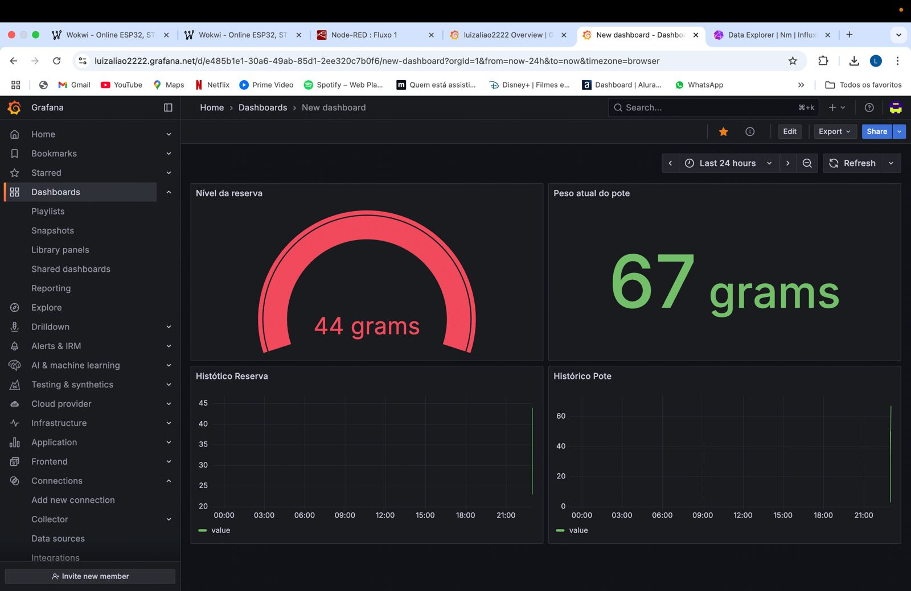
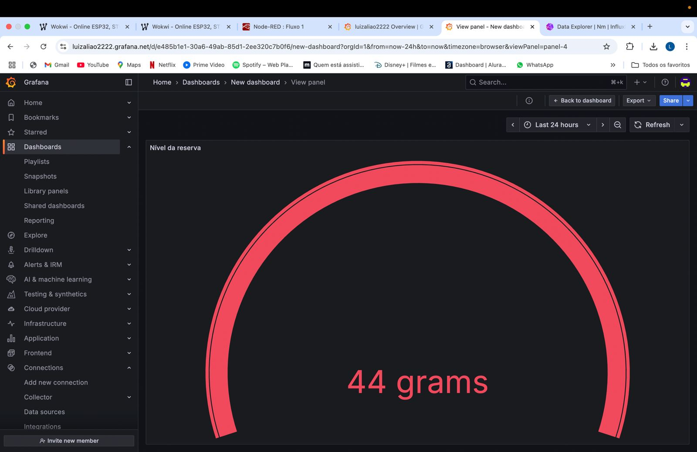
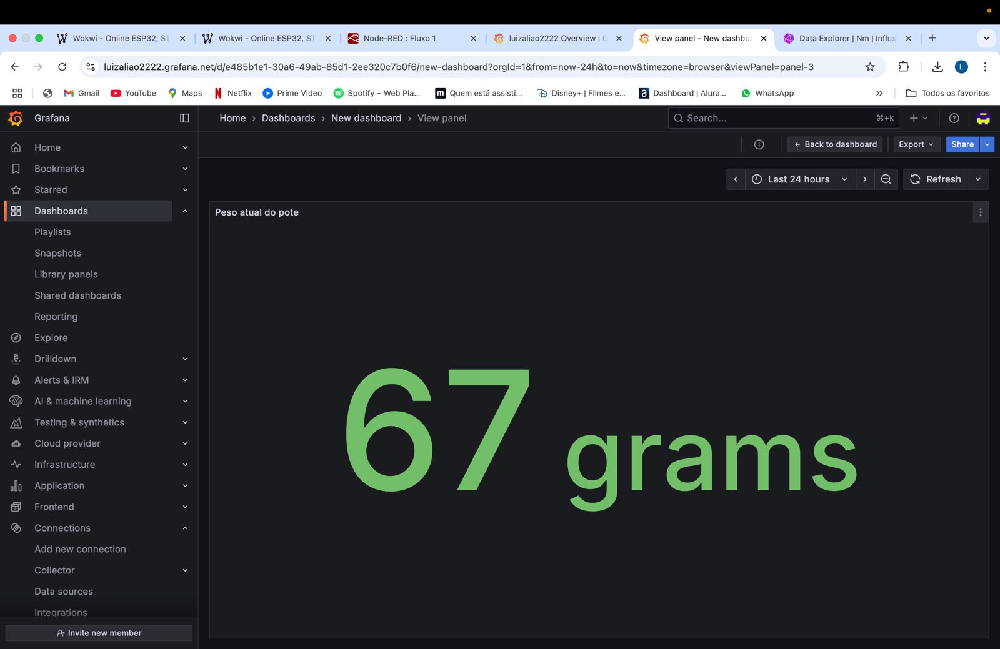
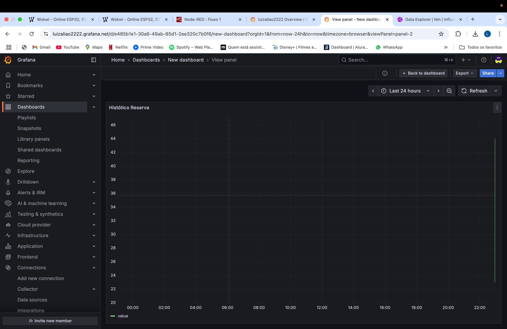
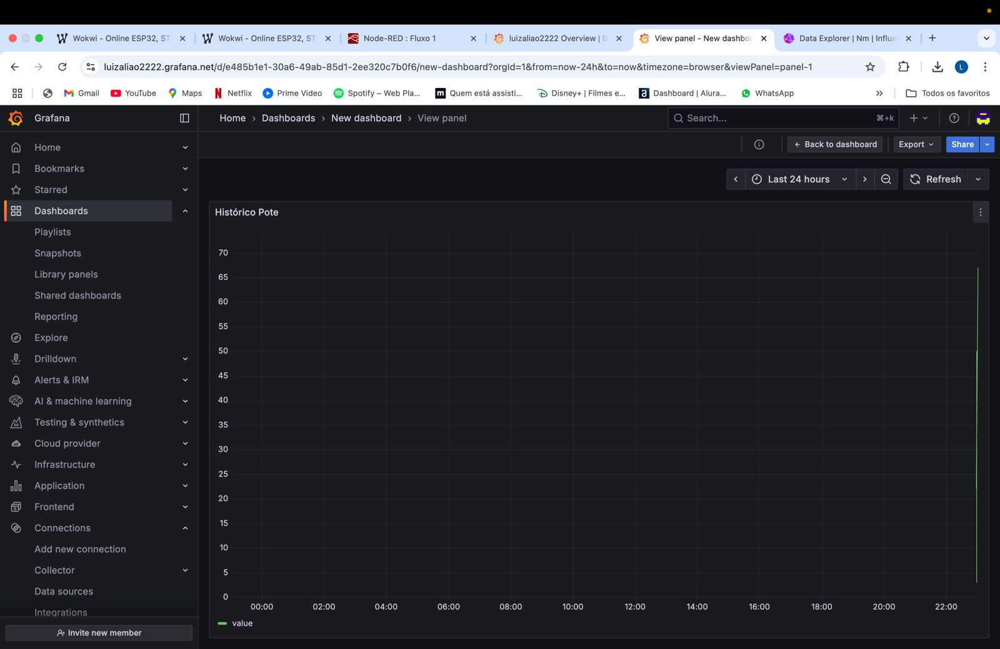
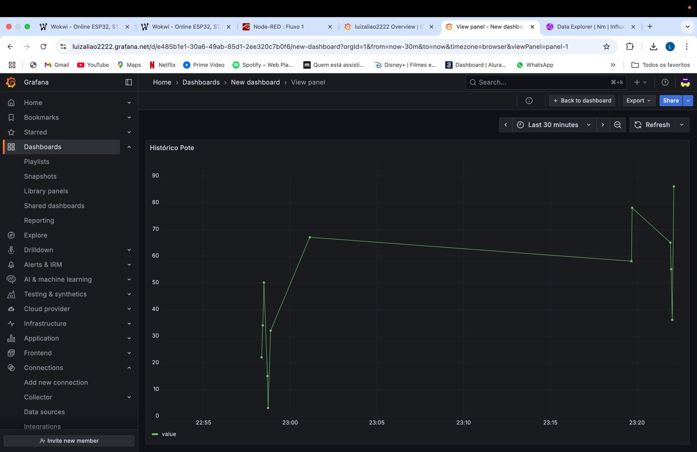
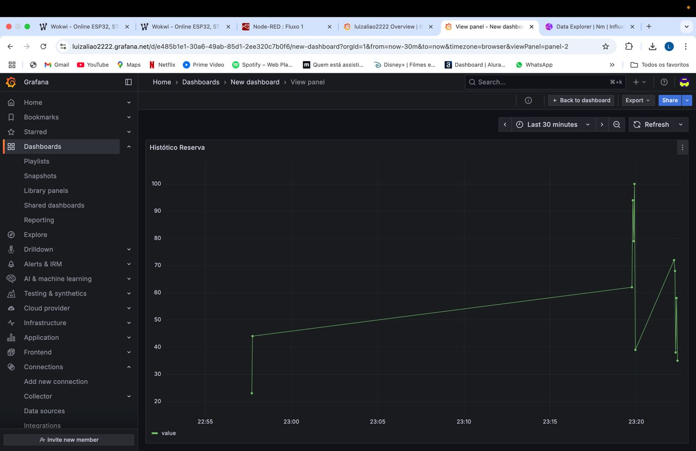

# 🐝 HoneyDrop — Alimentador Automático com IoT

O **HoneyDrop** é um projeto de IoT desenvolvido para monitorar o nível de ração em potes e liberar mais alimento de forma automática, ideal para uso em abrigos ou residências com animais. O sistema integra sensores físicos simulados no Wokwi, automação via Node-RED, armazenamento no InfluxDB e alertas via API do WhatsApp.

---

## 📦 Estrutura do Projeto
HoneyDrop/
├── dispositivo1/ # Sensor de ração (potenciômetro)
├── dispositivo2/ # Motor que libera ração (servo)
├── flows.json # Fluxo do Node-RED
└── README.md
## 📊 Tecnologias Utilizadas

- 🧠 **ESP32** (simulado no Wokwi)
- 🌀 **Node-RED** (automação dos dispositivos)
- 📈 **InfluxDB** (armazenamento de dados)
- 📊 **Grafana** (dashboard de monitoramento)
- 💬 **API do WhatsApp** (notificações automáticas)

---
# Prints do Grafana

# Nível de ração ao longo do tempo

# Ração abaixo do limite

# Alerta configurado

# Outros exemplos de dashboards

